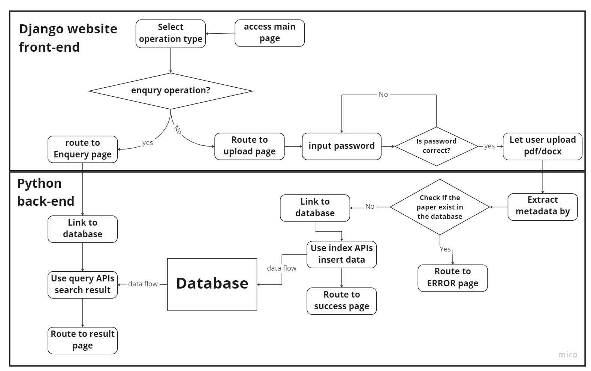

# Assessment 1: Design and Planning

## Requirement Engineering
This program aims to provide a platform for users to search for academic papers and request relational data, including between authors, citations network and more. The program consists of three main parts: GUI, database and query. GUI provides a user-friendly interface for input and output, the dataSecondly, it provides a better support base that processes and stores data from academic papers and we design a set of queries to output meaningful results.

The requirements including details are as follows (with priority 3 being the highest, 1 being lowest):
| Requirement Items                                                    | Priority | Details                                                                                                                                            |
|----------------------------------------------------------------------|----------|----------------------------------------------------------------------------------------------------------------------------------------------------|
| **GUI**                                                                  |          |                                                                                                                                                    |
| Initial web interface design                                         | 3        | Design the web interface that will be used for user input, display output, and adding paper                                                        |
| Web interface with Django                                            | 3        | Using Django library create a web interface as the main GUI for our program                                                                        |
| Design and implement main page (search bars)                         | 2        | Adding search bars for each catagories, buttons to do the search and add paper                                                                     |
| Design and implement result page (table and button)                  | 2        | Implement result page, which will be in the form of a table. In addition the button to go back to the main page                                    |
| Design and implement result page (export button)                     | 2        | Implement function to export the table results                                                                                                     |
| Implement different seach filters                                    | 1        | Create connection search filters where user can select link which category by which category                                                       |
| Design and implement add paper page (Upload function)                | 1        | Implement add paper page, including the upload button                                                                                              |
| Design and implement add paper page (security)                       | 1        | Implement a password protected upload action                                                                                                       |
|                                                                      |          |                                                                                                                                                    |
| **Database**                                                             |          |                                                                                                                                                    |
| MongoDB and Django interaction                                       | 3        | Build application using MongoDB on python web framework                                                                                            |
| Convert SQLite and implement MongoDB database                        | 3        | Convert the database from the prototype (SQLite) to MongoDB                                                                                        |
| Build the database                                                   | 2        | Create model of entities                                                                                                                           |
|                                                                      |          |                                                                                                                                                    |
| **Data Extraction**                                                      |          |                                                                                                                                                    |
| Function to transform pdf to .docx                                   | 3        | Implement the function to convert pdf to docx file                                                                                                 |
| Function to extract title                                            | 2        | Implement the function to find title from the document                                                                                             |
| Function to extract keywords from abstract                           | 2        | Implement the function to find keywords of the documents                                                                                           |
| Function to extract authors'  name                                   | 2        | Implement the function to find the authors' name from the document                                                                                 |
| Function to extract authors' email address                           | 2        | Implement the function to find the authors' email address from the document                                                                        |
| Function to extract authors' research group                          | 2        | Implement the function to find the authors' research group from the document                                                                       |
| Function to extract authors' department                              | 2        | Implement the function to find the authors' department from the document                                                                           |
| Function to extract authors' organisation                            | 2        | Implement the function to find the organisation of the authors from the document which includes University and Company                             |
| Function to extract authors' city (depending on the organisation)    | 2        | Implement the function to find the city of the authors based on their organisation                                                                 |
| Function to extract authors' country (depending on the organisation) | 2        | Implement the function to find the country of the authors based on their organisation                                                              |
| Function to extract refrence's title                                 | 2        | Implement the function to find the title of the references                                                                                         |
| Function to extract refrence's publish date (year)                   | 2        | Implement the function to find the publication year of the references                                                                              |
| Function to extract reference's type                                 | 2        | Implement the function to find the type of the references                                                                                          |
| Testing paper entity data extraction                                 | 1        | Test atributes extraction functions related to paper entities                                                                                      |
| Testing author entity data extraction                                | 1        | Test attributes extraction functions related to author entities (not including location)                                                           |
| Testing location entity extraction data                              | 1        | Test attributes extraction functions related to location entities (completed after author entity testing)                                          |
| Testing refrence entity extraction data                              | 1        | Test attributes extraction functions related to refrence entities                                                                                  |
|                                                                      |          |                                                                                                                                                    |
| **Data Extraction using NLP**                                            |          |                                                                                                                                                    |
| Literature review on NLP model                                       | 3        | Research on different NLP model and how it will suit our application                                                                               |
| Model training phase                                                 | 3        | Experiment on NLP model                                                                                                                            |
| Test sentiment extraction                                            | 2        | Test to extract sentiment of specific sections in the documents                                                                                    |
| Test theme extraction                                                | 2        | Test to extract theme of the documents                                                                                                             |
| Implementation of NLP                                                | 2        | Implement sentiment and theme data into our data model                                                                                             |
|                                                                      |          |                                                                                                                                                    |
| **Data Modelling**                                                       |          |                                                                                                                                                    |
| Function to create collections with appropriate entities attributes  | 3        | Create collections which include paper, author, location, outer_refrence                                                                           |
| Insert data into collections                                         | 3        | Insert the extracted data into each associated collections                                                                                         |
|                                                                      |          |                                                                                                                                                    |
| **Query**                                                                |          |                                                                                                                                                    |
| Function to convert user input to MongoDB query                      | 3        | Translate user input into database query, for user without database query experience                                                               |
| search papers by title                                               | 3        | function to find a paper by its title                                                                                                              |
| search papers by topic                                               | 3        | function to find related papers in a topic                                                                                                         |
| search papers by author                                              | 3        | function to find all papers related to the authors                                                                                                 |
| sort papers by paper's name                                          | 3        | function to show papers in ascending and descending alphabetical order                                                                             |
| sort papers by time                                                  | 3        | function to show papers in ascending and descending chronological order                                                                            |
| sort papers by number of reffered times                              | 3        | sort papers by number of reffered times in ascending and descending order                                                                          |
| sort papers by topics                                                | 3        | sort papers by topics, papers have same topics will be put together                                                                                |
| link papers by related authors                                       | 3        | search for same authors in different papers, those papers should be chosen by users                                                                |
| link papers by related references                                    | 3        | users provide some papers and the function should show the reference network between those papers                                                  |
| link papers by topics                                                | 3        |                                                                                                                                                    |
| link authors by topics                                               | 3        | show chosen authors' same research topics, and show some other authors in the same topics, if none return null                                     |
| link authors by coauthorship                                         | 3        |                                                                                                                                                    |
| link authors by organisation                                         | 3        | show if chosen authors are in same or related institutions                                                                                         |
| link authors by related papers                                       | 3        | show the direct connection(cooperate in same paper) and indirect connection(have same cooperators) of chosen authors                               |
| link between paper reference networks                                | 3        |                                                                                                                                                    |
| link related topics                                                  | 3        | if two topics can cooperate or appear in same paper, we assume they are related, so a topic table will be created and store all its related topics |
| present citation network                                             | 3        | a fuction to display the reference network of one paper's reference                                                                                |
| present author connections                                           | 3        | a function to display the connections between authors                                                                                              |
| present paper connections                                            | 3        | a function to display the connections between papers                                                                                               |
| search papers by doi                                                 | 2        | function to find a specific paper by its doi number                                                                                                |
| sort papers by authors' names                                        | 2        | sort papers by first author's name, letter ascending                                                                                               |
| link papers by organisation                                          | 2        |                                                                                                                                                    |
| search papers by organisation                                        | 1        | function to find all papers related to the organisation                                                                                            |
| sort papers by number of reference                                   | 1        |                                                                                                                                                    |
| link topics by organisation                                          | 1        | group topics by department frstly, and then find out if chosen topics are in same or related departments                                           |
|                                                                      |          |                                                                                                                                                    |
| **API**                                                                  |          |                                                                                                                                                    |
| Implement check existence                                            | 3        | Implement functions according to the design plan                                                                                                   |
| Implement extraction API                                             | 3        | Implement functions according to the design plan                                                                                                   |
| Implement relation search API                                        | 3        | Implement functions according to the design plan                                                                                                   |

### Design language and technology choices
The program will be written in python 3.8, it is simpler to develop compared to languages like C and performance is not the priority. We can shorten the development time. Also many libraries are available for python including matplotlib, spacy, and Django, which we are using the graphical user interface (GUI). Django is used in this program to build a local web interface for users to query, add paper and see/export relational results.

MongoDB will be implemented as our database for three main reasons:
Firstly, MongoDB supports multiple users accessing the database simultaneously.
Secondly, for many-to-one and many-to-many relations compared to SQL based databases. The number of many-to-many relations in our data model justify this change
Finally, the database involves a large volume of array data type. Examples include an author having several name formats, locations, and emails which are all stored in an array of string. MongoDB can store array type data originally.

### High-Level Design of the System

When the users start to use the system, they need to input the information they want to search with and select the result they wish to see, for example connection or just normal search for papers. Then the system will connect to the data base and run the query APIs to search related result with input information, and then show the result on the screen. If the users want to add their own papers in the database, they need to use 'upload' function, each users' account information will be stored in the sysytem, so they need identify their identities to get access to the database. Once users uploaded papers, the system will start to extract data from papers and check if the information of each paper already exsits in the data base, if it doesn't exsit, the system will link to the database and put information to database. 
Based on the MVC model there are three main parts of the program. Where Model is our MongDB database, View is the Django website front-end and Controller is the Python back-end. The data extracted includes:
-   Topic
-   Author
-   Institution
-   Date
-   Region
-   Emails

We then link the authors based on:
-   Co-author
-   organisation they work in
-   geographical connection
-   research group

The topic will be based on
-   Title
-   keywords in the abstract

The citation networks will be based of:
-   number of cited papers
-   time of publication

The search bar will be in the form of a list of search bars, which includes:
-   Topic
-   Author
-   Institution
-   Time
-   region

This search bar will be used to create a query for our database to allow users without SQL experiences to be able to use this program.

### Functions and Query Design
Query functions needed to be implemented for searching papers, linking based on papers/ authors/ topics relation and classifying results. Users can then have the option to query different types of results based on the input.

The search design will have separate input for doi, title, topic, authors, organisation and location search options and two drop lists on user interface to do the search of connections by different conditions.

Main login page

Users can put known elements for these six search options and the program will search for that information in the database. The options priority is from doi > title > author > organisation > topic > location, and every related paper and its attributes will be present to the screen. When the results are indicated by different options (e.g. by topic), results will rank from high to low priority instead.

Result page

Functions about linking authors, papers and topics will be offered to the users where they can choose what and how to link it. (e.g. papers linked by authors, departments or related references). After user input information and selected linking mode, what user input will be used as query statement’s arguments and information will be searched in the relevant table. For example, if a user wants to see the connection of papers, linked by related authors, the query function will search the ‘paper’ table and check each displayed paper’s authors and list every related authors for each paper.

After searching for papers, the result will be displayed in a table, a classification function will be offered to either classify or rank papers by each attribute. Users can choose a way to classify or rearrange those papers. For example, if arranged by time, the latest paper will be in the top row; if rearranged by authors, the papers will be sorted by first author’s name.

The program provides a password protected interface for user to upload paper into the database where the backend will check if the paper already exists in the database or needed to be added and extract its data.

 
Upload page

We will also offer a function to find the connection between different papers. Users can input several papers and choose the ‘link paper’ option, the program will then show if they are in the same topic, department and/or have the same authors by searching the “Paper” table. For each paper, a network can be created to show paper’s references and how those are being referred to by each other.

Below is an example diagram. An Additional function will be implemented to identify different papers with the same reference and reference network of the chosen paper.

Citation network example

When querying linkage between authors, users can input multiple authors’ names and related attributes that are the same or related (including cooperated papers, department, topics) will be shown as direct connection. If authors don’t share a direct connection, their cooperators will traverse to check if they have indirect connection. Users can also classify authors by different attributes (e.g. find out all the authors who come from University of Edinburgh).

 
Indirect vs direct connection network example

When linking topics, two options will be offered. Topics can cooperate in one same paper, for example, topics ‘hpc’ and ‘data science’ can work together in some research area, so they can be linked together. So the way to implement this is to check the topics(key words) in each paper and draw the relation graph to see how different topics cooperate with each other.

Connect network example

### Prioritised components in details

Our prioritised components of the whole program is the ability to provide linkage between entities.

Linkage diagram

First priority is to link papers with potential connections. Using extracted data which includes topics, the authors, their departments and citation papers a relationship is formed. Furthermore, related topics can be grouped by how papers mentioned them in abstract, where different papers with no direct topic relation but with related topic relation can be connected.

Second priority is the ability to link authors with potential connections. When a paper includes multiple authors, since they are in a co-authorship we use this information to define they are connected in a cooperation relationship. In addition, using the provided information from the paper which shows which department and/or research group and/or University the author can be linked to a unique location, authors located at the same location will have a location relationship, levels of organisations are also taken into consideration.

An additional function is the program can differentiate between the same person using a different name format, which can be classified as the same authors.

Thirdly, similar topics of each paper will be categorised together. This can be defined by the title of the article and the keywords contained within the abstract section. From this topic categorisation, it can also be applied to and expands our author connection networks.

Finally, the program provides the ability to generate citation networks on specific topics. Using topic categorisation, based on the number of times a paper is referenced on the same topic with the time of publication to generate citation networks.

using the extracted data from these documents. The authors are connected based on the co-authors of the paper, People who have written the paper together are grouped together.

### Data modelling
As mentioned above, the program will implement and use MongoDB as our database, for its advantage to create array type attributes to design out models with the many to many relations clearly.

Example of many-to-many relation includes:
-   Multiple papers having multiple authors/ researchers
Example of many-to-one relation includes:
-   Single author having multiple locations

In our design, five collections will be used store our data, which includes:
-   Location
-   Author
-   Paper
-   Outer_reference
-   Topic

Where every collection contains _id, which is a unique id for each entity function similarly to a SQL primary key.

First, Location collection has 5 attributes (excluding _id):
-   id
-   Country
-   City
-   Organisation
-   Department
-   Group

The location details can be extracted directly from papers using spaCy. Put all of the valid locations into a sorted list and make sure the case of list already is normalised.  Loop over individual "words'' in input text and at the start of each new word, start a new binary search in the location list. If a no-match is found, the entire word will be skipped and proceed with the next.

Second, Author collection has 5 attributes (excluding _id):
-   ORCID
-   Papers_dois
-   Names
-   Emails
-   Locations_id
-   Topic_id

Different to Location collection, ORCID is used as id instead of default id value in _id field, which is an unique Identifier for each author that can be determined from a public database. Paper_dois is an array of string storing all doi’s of papers written by this author.

ORCID and doi can not be extracted from papers directly. But using the author's name and location the ORCID can be determined using a public database. For doi, we plan to query from Crossref ([http://www.crossref.org](https://www.crossref.org/guestquery/)) and for ORCID from their website ([https://orcid.org/](https://orcid.org/)).

Names and Emails are defined as an array of string, and for Location_id is an array of integers, since an author may work in multiple locations, and name is represented in different formats depending on the paper (e.g. middle name, abbreviation) and emails.

Third, Paper collection has 8 attributes (excluding _id):
-   doi
-   Title
-   Date
-   Author_ids
-   Inner_refrence_ids
-   Outer_refrence_ids
-   Topics_ids
-   Themes
-   Sentiment

Like Location, doi is used at _id. And paper’s doi, inner references dois’, outer references dois’ and Date are queried from public databases.

Title and Topics (extracted from abstract’s keywords) are extracted directly with spaCy.

Inner reference refers to papers that are cited that happened to also be in the database. While outer reference refers to papers that are cited but are not in the database.

Sentiments however first needed to be analysed by the NLP model as it is not a string or an integer. It will be stored as integers indicate its rating.

Fourth, Outer_references has 3 attributes (excluding _id):
-   id
-   Title
-   Date
-   Type

id is set as default for the _id field. Title is extracted using spaCy as string, Date is queried from public databases, id is a unique id instead of doi and Type is the reference type stored as integer.

While Inner reference must be paper, outer reference can range from github repositories, websites to paper and more. When adding paper to our program, a function will be used to analyse the type of outer references and assign a one-hot code.

Lastly Fifth, Topic collection has 2 attributes (excluding _id):
-   Id
-   Name
-   Paper_dois

Paper_dois in array\[string type.\]

 
The structure of MongoDB database

### APIs and relations explanation
We define 9 direct relation between each entities (see Figure x (entity link fig from above)):
|Relation|Description|
|------- |-----------|
|<em>with topic|Paper(s) have a topic(s)|
|<em>authorship|Author(s) wrote a paper(s)|
|<em>locate|Author(s) locates in a location(s)|
|<em>cite|Paper cites paper(s) and/or outer reference(s)|
|<em>location|Two authors share the same location|
|<em>cooperation|Two author wrote for the same paper|
|<em>topic|Two papers have the same topic|
|<em>sentiment|Two paper have the same sentiment|
|<em>related topic|Two topics belong to the same paper|

With these relation, functions and API can then be developed

### Check existence:
The following functions are to be implemented to provide functions.
-   check_Paper(DB: MongoClient) -> bool  
    - Check if a paper exists in the database.
-   check_OR(DB: MongoClient) -> bool  
    - Check if an outer_reference exists in the database.
-   check_Location(DB: MongoClient) -> bool  
    - Check if a location exists in the database.
-   check_Author(DB: MongoClient) -> bool  
    - Check if an author exists in the database.
-   check_Topic(DB: MongoClient) -> bool  
    - Check if a topic exists in the database.

### Extraction API:
The following functions are to be implemented for data extraction.
-   pdf2docx(pdf_file: str, docx_file: str)
    - transform pdf file to doc file
-   docx_info(docx_file: str) -> dic  
    - Extract title, topics, references, authors, locations from docx file. Then update database.
-   docx_search(title: str) -> dic  
    - Search doi and date. Then update database.
-   author_search(name: str)->str
    - Search the ORCID of author, and update database. Then update database.
-   process_sentiment(docx_file: str) -> integer  
    - Process the sentiment by NLP model. Then update database.
-   process_theme(docx_file: str) -> integer  
    - Process the theme by NLP model. Then update database.

  ### Relation search API:
The following functions are to be implemented for relational search.
-   with_topic_relation_reverse(DB: MongoClient, Topic_name: str) -> list  
    - Return a list of papers with the input topic, which have this topic. 
-   with_topic_relation(DB: MongoClient, Paper_Title: str, Paper_doi: str) -> list  
    - Return a list of Topics with the input paper title or doi, which belong to this paper.
-   Authorship_relation_reverse(DB: MongoClient, Paper_Title: str, Paper_doi: str) -> list  
    - Return a list of Authors with the input paper title or doi , who wrote this paper.
-   Authorship_relation(DB: MongoClient, Author_Name: str, Author_ORCID: str) -> list  
    - Return a list of Papers with the input Author name or author ORCID, which was written by this author.
-   Locate_relation(DB: MongoClient, Author_Name: str, Author_ORCID: str) -> list  
    - Return a list of locations with the input author name or Author_ORCID, where the author has been located.
-   Locate_relation_reverse(DB: MongoClient, Country: str, City: str, Organisation: str, Department: str, Group: str) -> list  
    - Return a list of Authors with the input country, city, organisation, department and group, which work in this location.
-   OR_cite_relation(DB: MongoClient, Paper_Title: str, Paper_doi: str) -> list  
    - Return a list of outer references with the input paper name or paper doi, which this paper cited.
-   OR_cite_relation_reverse(DB: MongoClient, OR_Title) -> list  
    - Return a list of papers with the input outer reference title, which cited this outer reference.
-   IR_cite_relation(DB: MongoClient, Paper_Title: str, Paper_doi: str) -> list  
    - Return a list of papers with input paper title or doi, which this paper cited.
-   IR_cite_relation_reverse(DB: MongoClient, Paper_Title: str, Paper_doi: str) -> list  
    - Return a list of papers with input paper title or doi, which are cited by this paper.
-   location_relation(DB: MongoClient, Author_Name: str, Author_ORCID: str) -> list  
    - Return a list of authors with Author name or author ORCID, which is located in the same location with this author.
-   cooperation_relation(DB: MongoClient, Author_Name: str, Author_ORCID: str) -> list  
    - Return a list of authors with Author name or author ORCID, which have worked for the same paper.
-   topic_relation(DB: MongoClient, Paper_Title: str, Paper_doi: str) -> list  
    - Return a list of papers with input paper title or paper doi, which have one same topic.
-   sentiment_relation(DB: MongoClient, Paper_Title: str, Paper_doi: str) -> list  
    - Return a list of papers with input paper title or paper doi, which have the same sentiment.
-   related_topic_relation(DB: MongoClient, Topic_Name: str) -> list  
    - Return a list of topics with input topic, which belong to the same paper.
    

-   check_with_topic(DB: MongoClient, Paper_Title: str, Paper_doi: str, Topic_name: str)->bool
    - Check if the input paper have the input topic.
-   check_authorship(DB: MongoClient, Author_Name: str, Author_ORCID: str, Paper_Title: str, Paper_doi: str)->bool
    - Check if the author write the input paper.
-   check_locate(DB: MongoClient, Author_Name: str, Author_ORCID: str, Country: str, City: str, Organisation: str, Department: str, Group: str)->bool
    - Check if the input author locate in the input location.
-   check_IR_cite(DB: MongoClient, Paper_Title1: str, Paper_doi1: str, Paper_Title2: str, Paper_doi2: str)->bool
    - Check if the input paper1 cite the input paper2.
-   check_OR_cite(DB: MongoClient, Paper_Title: str, Paper_doi: str, OR_Title: str)->bool
    - Check if the input paper cite the input outer reference.
-   check_location(DB: MongoClient, Author_Name1: str, Author_ORCID1: str, Author_Name2: str, Author_ORCID2: str)->list
    - Return the common locations of the input two authors.
-   check_cooperation(DB: MongoClient, Author_Name1: str, Author_ORCID1: str, Author_Name2: str, Author_ORCID2: str)->list
    - Return the common papers of the input two authors.
-   check_topic(DB: MongoClient, Paper_Title1: str, Paper_doi1: str, Paper_Title2: str, Paper_doi2: str)->list
    - Rethrn the common topics of the input two papers.
-   check_sentiment(DB: MongoClient, Paper_Title1: str, Paper_doi1: str, Paper_Title2: str, Paper_doi2: str)->list
    - Rethrn the common sentiment of the input two papers.
-   check_related_topics(DB: MongoClient, Topic_Name1: str, Topic_Name2: str)->list
    - Return the list of papers that comtain these two input topics.  

## Timeline and Initial Task Planning

Project roadmap

We will be implementing an agile methodology to manage this project using Atlassian, with tools including Jira to track issues, and miro board to design our workflow with the team.

We have planned the whole project grouped by 5 sprints. The total project is estimated to go for 4 months, including a gap between exam periods and Christmas holiday.

The first sprint starts on 21 November 2022 and lasts for 14 days. This sprint will focus on creating an initial setup including the web interface and database planning, and GUI creation.  These components are crucial for testing our application in the further stages.

The second sprint starts on 9 January 2023 and lasts for 1 month. This sprint will focus on database creation with correct data extraction. These components are required for linking and searching data in the later stages.

The third sprint is planned but is subjected to change, depending on the outcome of the first and second sprint. 

#### Sprint 1 : Initial setup
| |Design and Planning|(2 days)|
|-|------------------------|----------------------|
| |Design initial web interface||
| |Plan data connection within database||

| |Initial GUI creation|(10 days)|
|-|------------------------|----------------------|
| |Initial web interface with Django||
| |MongoDB and Django interaction||
| |Design and implement main page (search bars)||
| |Design and implement result page (table and button)||
| |Design and implement result page (export button)||
| |Design and implement add paper page (upload function)||
| |Design and implement add paper page (security)||
| |Implement paper sorting function||
| |Implement different search filters||

#### Sprint 2 : Database and data extraction
| |Convert SQLite to MongoDB|(5 days)|
|-|------------------------|----------------------|
| |Convert SQLite to MongoDB
| |Build the database||
| |Create collections within entities attributes||
| |Insert data into collections||

| |Implement Data Extraction|(20 days)|
|-|------------------------|----------------------|
| |Function to transform pdf to docx||
| |Extract document related data||
| |Extract authors related data||
| |Extract citations related data||
| |Test paper entity data extraction||
| |Test author entity data extraction||
| |Test reference entity data extraction||

#### Sprint 3 : API
| |Index API|(10 days)|
|-|------------------------|----------------------|
| |Check existence||
| |NLP data extraction||

| |Query API|(10 days)|
|-|------------------------|----------------------|
| |Implement conversion of user input to MongoDB query||
| |Test user input conversion||
| |Implement paper search function||
