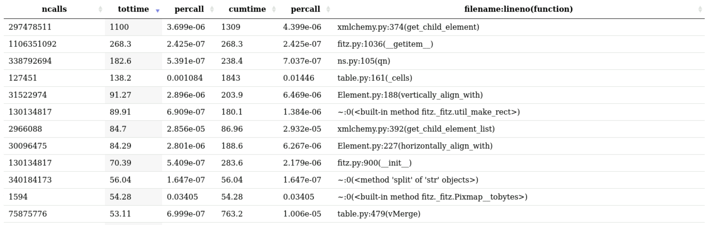

Test commit message

# Formative Group Assessment: Prototype review

> Patrick__Barrera_and_Collins

## 1. Functionality

The prototype functions as a basic academic paper library with 2 main functions. First function is converting pdf documents to docx files and extract named entities to SQLite data base. The second function is converting normal languages to SQL query and query the database. Program first reads metadata from provided excel file and converts pdf/docx documents to docx database. Metadata include the paper's title, author’s name, and which organisation its from. Prompt-terminal pops up after data conversion finishes, users can then use it to query papers with previously mentioned metadata, provided with auto-complete and alias search functions.

## 2. Defects

The conversion process cannot be accurately profiled when executing this software all at once. Part of the database query conversion procedure is redundant, it converts data again that was converted during the first iteration.

## 3. Dependencies

The first group of dependencies are used for reading, writing, and creating document files. The input files are converted into a JSON SQL database. These dependencies include the following:

1. build from distutils.command.build : use to build command
2. parse from pdf2docx : use to convert pdf to docx
3. docx : create and update docx document with python
4. simplify from simplify_docx : extracting docx word elements into JSON format
5. json : json encoder and decoder for JSON data interchanging with python
6. spacy : Natural language processing used here to put string array into SQLite/ JSON object
7. os : used to list all files and folder in a directory
8. exists from os.path : path name manipulation used here to join path
9. sqlite3 : to connect to database we used SQLite here (e.g. commit in end of the prototype)
10. Error from sqlite3 : provide error checking functions
11. openpyxl : read and write excel file (.xmlx)
12. Path from pathlib : offers classes representing filesystem paths with semantics appropriate for different operating systems

The second group of dependencies are used to prompt an interactive command line. This allows users to input their query. These dependencies include the following:

1. prompt from prompt_toolkit : used to create the interactive prompt command line window
2. FileHistory from prompt_toolkit.history : to access the history
3. AutoSuggestFromHistory from prompt_toolkit.auto_suggest : autocomplete for user input
4. WordCompleter from prompt_toolkit.completion : allow user to enter alias to complete word

## 3. Performance analysis

Prototype profiled using python built-in profilers on a EDIF virtual machine. Total of five profiling procedures were generated to evaluate the reliability and repeatability processes’ execution time. SnakeViz is used to visualise distribution resources.

The five running time:

|Running time (s)|
|-|
|3699.240|
|3689.475|
|3888.978|
|3587.360|
|4216.785|

Average running time: 3816.3676 s

Profiling procedure:

1. Remove all of the existing converted files

2. Run the standard profiling function for python with additional ranked by cumulative time flag

3. Visualise results with SnakeViz


Associated code:

```bash
rm data/* Docs/* Ents/* JSON/*

python -m cProfile -s cumtime -o profile ./prototype.py

snakeviz profile
```

Visualization for first profile:




## 4. Improvement suggestions

We suggested improvement in terms of project structure and adding parallelism. Separating the code into two scripts should increase the practicality when running and profiling. First part of the document conversion should not be required to run every time if the user only wants to query the existing database. Furthermore, various sections of the code are redundant and could be parallelized using model Threading and multiprocessing.

## 5. Profiling process
Generate profile

```bash
python -m cProfile -o profile prototype.py
```

Get the original content of profile

```bash
cprofilev -f profile
```

Visualize profile

```bash
snakeviz profile
```
